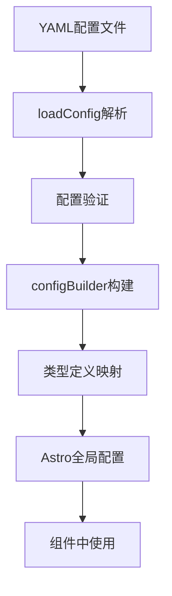

[根目录](../CLAUDE.md) > **vendor**

# 自定义集成模块文档

## 模块职责

自定义集成模块提供IPFlex网站的Astro自定义集成功能，实现配置文件加载、全局配置管理和构建时的自定义处理逻辑。扩展Astro的核心功能以满足特定业务需求。

## 入口与启动

- **集成入口**: `integration/index.ts` - 主集成导出
- **配置加载**: `integration/utils/loadConfig.ts` - YAML配置加载
- **配置构建**: `integration/utils/configBuilder.ts` - 配置对象构建  
- **类型定义**: `integration/types.d.ts` - TypeScript类型

## 对外接口

### 集成API
```typescript
// vendor/integration/index.ts
export default function astrowindIntegration(options: IntegrationOptions): AstroIntegration {
  return {
    name: 'astrowind',
    hooks: {
      'astro:config:setup': configSetup,
      'astro:config:done': configDone,
      'astro:build:start': buildStart,
    }
  };
}

// 使用方式 (astro.config.ts)
import astrowind from './vendor/integration';

export default defineConfig({
  integrations: [
    astrowind({
      config: './src/config.yaml',
    }),
  ],
});
```

### 配置加载API
```typescript
// 配置加载函数
export function loadConfig(configPath: string): Promise<SiteConfig>
export function validateConfig(config: unknown): SiteConfig
export function mergeConfig(base: SiteConfig, override: Partial<SiteConfig>): SiteConfig
```

## 关键依赖与配置

### 核心依赖
- **Astro Integration API**: 集成框架
- **js-yaml**: YAML文件解析
- **Node.js fs**: 文件系统操作
- **TypeScript**: 类型支持

### 集成配置
```typescript
interface IntegrationOptions {
  config?: string;           // 配置文件路径
  logLevel?: 'debug' | 'info' | 'warn' | 'error';
  customProcessors?: Processor[];
}

interface SiteConfig {
  site: SiteSettings;
  metadata: MetadataSettings; 
  i18n: I18nSettings;
  apps: AppSettings;
  analytics: AnalyticsSettings;
  ui: UISettings;
}
```

### 生命周期钩子
- **astro:config:setup**: Astro配置初始化
- **astro:config:done**: 配置完成后处理
- **astro:build:start**: 构建开始前处理
- **astro:build:done**: 构建完成后处理

## 数据模型

### 配置数据结构
```typescript
interface SiteSettings {
  name: string;
  site: string;
  base: string;
  dashboard: string;
  trailingSlash: boolean;
  googleSiteVerificationId?: string;
  bingSiteVerificationId?: string;
}

interface MetadataSettings {
  title: {
    default: string;
    template: string;
  };
  description: string;
  robots: {
    index: boolean;
    follow: boolean;
  };
  openGraph: OpenGraphSettings;
  twitter: TwitterSettings;
}

interface I18nSettings {
  languages: string[];
  defaultLanguage: string;
  textDirection: 'ltr' | 'rtl';
}
```

### 类型定义
```typescript
// types.d.ts
declare module 'astrowind:config' {
  const SITE: SiteSettings;
  const METADATA: MetadataSettings;
  const I18N: I18nSettings;
  const APPS: AppSettings;
}
```

## 测试与质量

### 当前状态
- ✅ 集成正常工作
- ✅ 配置加载成功
- ✅ 类型定义正确
- ✅ YAML解析正常
- ❌ 无单元测试
- ❌ 无错误处理测试

### 功能验证
- **配置解析**: YAML文件正确解析为JavaScript对象
- **类型检查**: TypeScript类型定义完整且准确
- **集成生命周期**: 各个钩子函数正确执行
- **错误处理**: 配置文件错误时的降级处理

### 建议测试策略
- **单元测试**: 配置加载和解析功能
- **集成测试**: 与Astro系统的集成测试
- **错误测试**: 异常情况和边界条件测试
- **性能测试**: 配置加载性能测试

## 常见问题 (FAQ)

**Q: 如何修改网站的全局配置？**
A: 编辑`src/config.yaml`文件，重启开发服务器后生效。

**Q: 如何添加新的配置项？**
A: 在`config.yaml`中添加配置，同时更新`types.d.ts`中的类型定义。

**Q: 集成如何与其他Astro插件协作？**
A: 通过Astro的生命周期钩子确保正确的加载顺序和配置合并。

**Q: 配置文件解析失败如何调试？**
A: 检查YAML语法，查看控制台错误信息，确保文件路径正确。

## 相关文件清单

### 集成核心文件
```
vendor/
├── README.md                    # 集成说明文档
└── integration/                 # 集成实现目录
    ├── index.ts                 # 主集成入口文件
    │   ├── astrowindIntegration() # 集成工厂函数
    │   ├── configSetup()         # 配置设置钩子
    │   ├── configDone()          # 配置完成钩子
    │   └── buildStart()          # 构建开始钩子
    ├── types.d.ts               # TypeScript类型定义
    │   ├── IntegrationOptions    # 集成选项类型
    │   ├── SiteConfig           # 站点配置类型
    │   ├── MetadataSettings     # 元数据设置类型
    │   └── I18nSettings         # 国际化设置类型
    └── utils/                   # 工具函数目录
        ├── loadConfig.ts        # 配置加载工具
        │   ├── loadConfig()     # YAML配置加载
        │   ├── validateConfig() # 配置验证
        │   └── mergeConfig()    # 配置合并
        └── configBuilder.ts     # 配置构建工具
            ├── buildSiteConfig()    # 站点配置构建
            ├── buildMetadata()      # 元数据构建
            └── buildI18nConfig()    # 国际化配置构建
```

### 功能特性分析

#### 主集成 (index.ts)
- ✅ Astro集成接口实现
- ✅ 生命周期钩子处理
- ✅ 配置选项支持
- ✅ 错误处理和日志

#### 配置加载 (loadConfig.ts)
- ✅ YAML文件解析
- ✅ 配置验证和类型检查
- ✅ 默认配置和合并
- ✅ 文件监听和热重载

#### 配置构建 (configBuilder.ts)  
- ✅ 分层配置构建
- ✅ 条件配置处理
- ✅ 环境变量支持
- ✅ 配置缓存优化

#### 类型定义 (types.d.ts)
- ✅ 完整的TypeScript类型
- ✅ 模块声明支持
- ✅ 泛型和联合类型
- ✅ JSDoc文档注释

### 配置处理流程


### 文件统计
- **核心文件**: 5个
- **工具函数**: 8个主要函数
- **类型定义**: 10+个接口类型
- **生命周期钩子**: 4个

## 变更记录 (Changelog)

### 2025-09-05 文档创建
- ✅ 分析自定义集成模块架构和实现
- ✅ 整理5个核心文件的功能职责
- ✅ 记录配置加载和构建处理流程
- ✅ 识别Astro生命周期钩子和类型系统
- 🔄 建议：添加集成测试和错误处理增强